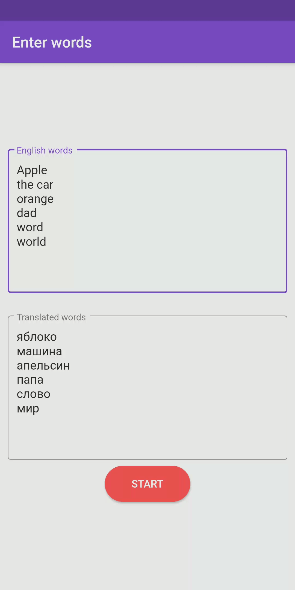

# Easy Word learn
> An app for quickly learning new English words.

## Table of contents
* [General info](#general-info)
* [Screenshots](#screenshots)
* [Technologies](#technologies)
* [Test](#test)
* [Contact](#contact)

## General info
To use the application, in the English Words field, you need to enter the words in English, and in the "Translated Words" field you need to enter the translation of the same words in the same order. Then the application randomly mixes them, and you must enter the correct English word for translation.

## Screenshots

  

## Technologies
* Flutter
* Dart

## Test
[Download apk](easy_word_learn.apk)

## Contact
Created by tymur.saparov1@gmail.com

